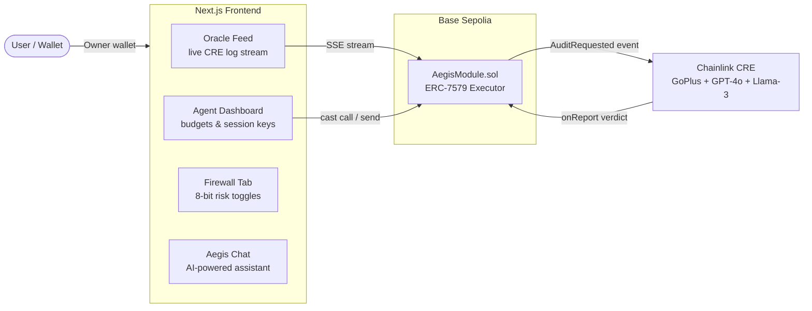

# Aegis Protocol V5 — Frontend

Next.js command center for the Aegis Protocol. Connects to Base Sepolia and the Chainlink CRE oracle to show real-time audit results, agent activity, and on-chain verdicts.



## UI Buttons — What Each One Does

| Button | Location | Action | On-Chain? | Notes |
|---|---|---|---|---|
| **Subscribe Agent** | Agents tab, top right | Calls `subscribeAgent(addr, budget)` on AegisModule | ✅ Real TX on Base Sepolia | Shows ERC-7715 session key scope (permitted/blocked selectors) before confirming |
| **Revoke** | Each active agent card | Calls `revokeAgent(addr)` on AegisModule | ✅ Real TX on Base Sepolia | Sets agent allowance to 0, zeroes session key |
| **Simulate Trade → Oracle Feed** | Each active agent card | Triggers `requestAudit(token)` via the audit API → streams live CRE output | ✅ Real CRE pipeline | GoPlus + BaseScan + GPT-4o + Llama-3 consensus |
| **KILL SWITCH** | Top right, red | Calls `revokeAgent()` for all active agents | ✅ Real TX on Base Sepolia | Emergency revocation — zeroes all budgets |
| **Deposit / Withdraw** | Wallet section | Prompts for ETH amount, calls `depositETH()` or `withdrawETH()` | ✅ Real TX on Base Sepolia | Treasury management |
| **Firewall toggles** | Firewall tab | Updates `firewallConfig` JSON string on-chain | ✅ Real TX on Base Sepolia | 8-bit risk matrix: honeypots, proxies, tax thresholds |
| **Audit BRETT / HoneypotCoin** | Chat suggested prompts | Triggers CRE oracle pipeline via `/api/audit` SSE | ✅ Real CRE pipeline | Results stream into Oracle Feed panel |
| **Quick-fill demo addresses** | Subscribe form | Pre-fills agent address and budget (ALPHA, SIGMA, OMEGA) | No TX — UI only | Convenience buttons for demo presentations |

## What Is Real vs Mocked

| Feature | Status | Details |
|---|---|---|
| Agent subscription/revocation | ✅ Live | `subscribeAgent()` and `revokeAgent()` execute real transactions on Base Sepolia |
| Budget enforcement | ✅ Live | `agentAllowances` mapping enforced on-chain in `triggerSwap()` with CEI pattern |
| ERC-7715 session key scope display | ⚠️ UI visualization | Session scope (selectors, target, expiry) is displayed from `v5_session_config.ts`. The SmartSessionValidator is not installed on the Safe — budget enforcement via `agentAllowances` provides equivalent security |
| CRE Oracle pipeline | ✅ Live | GoPlus API → BaseScan → GPT-4o → Llama-3 → on-chain consensus via Chainlink CRE |
| Token swap execution | ⚠️ Mock on testnet | Base Sepolia has no Uniswap V3 liquidity. `triggerSwap` emits `SwapExecuted` with mock 1:1000 ratio. Production Uniswap V3 code preserved in comments |
| Chat agent awareness | ✅ Live | Chat reads `agentAllowances` directly from Base Sepolia for all known addresses |
| Wallet balance/treasury | ✅ Live | Real ETH balances from Base Sepolia |
| Demo suggestion addresses | Mock addresses | ALPHA, SIGMA, OMEGA are placeholder addresses for quick demo setup |

## Features

- **Oracle Feed** — live SSE streaming of the CRE pipeline (GoPlus → BaseScan → GPT-4o → Llama-3 → verdict)
- **Aegis Chat** — AI assistant reads live chain state: agents, allowances, audit verdicts
- **Agent Dashboard** — real on-chain agent management with ERC-7715 session key visualization
- **Firewall Tab** — 8-bit risk toggles matching `AegisModule.firewallConfig`
- **Audit Log** — real on-chain events (AuditRequested, ClearanceUpdated, ClearanceDenied)
- **Marketplace** — browse tokens and trigger audits

## Getting Started

```bash
cd aegis-frontend
npm install
npm run dev
```

Open [http://localhost:3000](http://localhost:3000).

> **Requires:** The CRE oracle Docker node running (`docker compose up --build -d` from repo root) and Base Sepolia ETH in the deployer wallet.

## Key Components

| Component | File | Description |
|---|---|---|
| Oracle Feed | `components/OracleFeed.tsx` | Live SSE stream with phase indicators and LLM reasoning |
| Aegis Chat | `components/AegisChat.tsx` | AI assistant with live chain state awareness |
| Agents Tab | `components/AgentsTab.tsx` | Agent subscription with ERC-7715 session key scope display |
| Firewall Tab | `components/FirewallTab.tsx` | 8-bit risk matrix toggles |
| Audit Log | `components/AuditLogTab.tsx` | On-chain event history |
| Marketplace | `components/MarketplaceTab.tsx` | Token browsing and audit triggers |

## API Routes

| Route | Method | Description |
|---|---|---|
| `/api/wallet` | GET | Returns owner address, balance, module address |
| `/api/audit?token=BRETT` | GET (SSE) | Triggers audit + streams CRE output in real-time |
| `/api/agents` | GET | Reads `agentAllowances` for known addresses + event logs |
| `/api/agents` | POST | `subscribe` or `revoke` — real on-chain transactions |
| `/api/firewall` | GET/POST | Firewall config read/write |
| `/api/events` | GET | On-chain event log |
| `/api/chat` | POST | AI assistant — reads live chain state, responds with agent/audit info |
| `/api/docker-status` | GET | CRE Docker container health check |

## Related

- [Root README](../README.md) — full protocol overview
- [Demo Guide](../docs/DEMO_GUIDE.md) — how to run demo scripts
- [CRE Oracle](../cre-node/README.md) — oracle node setup
- [ERC Standards](../docs/ERC_STANDARDS.md) — ERC-4337, ERC-7579, ERC-7715 implementation details
