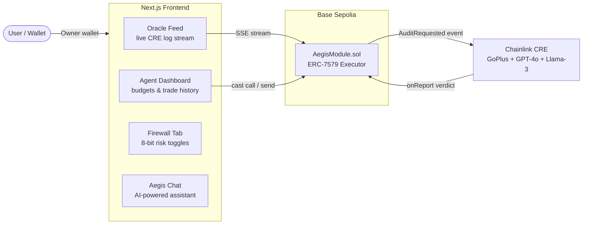

# 🖥️ Aegis Protocol V5 — Frontend

Next.js command center for the Aegis Protocol. Connects to Base Sepolia and the Chainlink CRE oracle to show real-time audit results, agent activity, and on-chain verdicts.



## Features

- **Oracle Feed** — live SSE streaming of the CRE pipeline (GoPlus → BaseScan → GPT-4o → Llama-3 → verdict)
- **Aegis Chat** — AI-powered assistant for protocol interaction
- **Agent Dashboard** — shows subscribed agents, budgets, and trade history
- **Firewall Tab** — 8-bit risk toggles matching `AegisModule.firewallConfig`
- **Audit Log** — real on-chain events (AuditRequested, ClearanceUpdated, ClearanceDenied)
- **Marketplace** — browse tokens and trigger audits

## Getting Started

```bash
cd aegis-frontend
npm install
npm run dev
```

Open [http://localhost:3000](http://localhost:3000).

> **Requires:** The CRE oracle Docker node running (`docker compose up --build -d` from repo root) and Base Sepolia ETH in the deployer wallet.

## Key Components

| Component | File | Description |
|---|---|---|
| Oracle Feed | `components/OracleFeed.tsx` | Live SSE stream with phase indicators and LLM reasoning |
| Aegis Chat | `components/AegisChat.tsx` | AI assistant for protocol commands |
| Agents Tab | `components/AgentsTab.tsx` | Agent subscription management |
| Firewall Tab | `components/FirewallTab.tsx` | 8-bit risk matrix toggles |
| Audit Log | `components/AuditLogTab.tsx` | On-chain event history |
| Marketplace | `components/MarketplaceTab.tsx` | Token browsing and audit triggers |

## API Routes

| Route | Method | Description |
|---|---|---|
| `/api/wallet` | GET | Returns owner address, balance, module address |
| `/api/audit?token=BRETT` | GET (SSE) | Triggers audit + streams CRE output in real-time |
| `/api/agents` | GET/POST | Agent subscription management |
| `/api/firewall` | GET/POST | Firewall config read/write |
| `/api/events` | GET | On-chain event log |
| `/api/chat` | POST | AI assistant endpoint |

## Related

- [Root README](../README.md) — full protocol overview
- [Demo Guide](../docs/DEMO_GUIDE.md) — how to run demo scripts
- [CRE Oracle](../cre-node/README.md) — oracle node setup
