# 🔗 Aegis V5 — Chainlink CRE Oracle Node

The Chainlink Runtime Environment (CRE) oracle that powers Aegis V5's off-chain AI security audit pipeline. Runs on Base Sepolia. All external API calls go through `ConfidentialHTTPClient` — API keys never leave the DON.

## CRE Oracle Pipeline

```mermaid
flowchart TD
    A(["AuditRequested\non-chain event"]) --> B["Phase 1\nGoPlus"]
    B --> |"ConfidentialHTTPClient"| C["GoPlus API\nhoneypot · sell restriction · proxy"]
    C --> D["Phase 2\nBaseScan"]
    D --> |"ConfidentialHTTPClient"| E["BaseScan API\nfull Solidity source fetched"]
    E --> F["Phase 3\nAI Consensus"]
    F --> |"ConfidentialHTTPClient"| G["GPT-4o\nobfuscated tax · logic bomb"]
    F --> |"ConfidentialHTTPClient"| H["Llama-3\nindependent verification"]
    G --> I["Union of Fears\nblocked if EITHER flags risk"]
    H --> I
    I --> J(["onReport\nriskScore → AegisModule"])

    style A fill:#fff3e0,stroke:#e65100,color:#bf360c
    style B fill:#fffde7,stroke:#f9a825,color:#f57f17
    style C fill:#fffde7,stroke:#f9a825,color:#f57f17
    style D fill:#e0f7fa,stroke:#00838f,color:#006064
    style E fill:#e0f7fa,stroke:#00838f,color:#006064
    style F fill:#f3e5f5,stroke:#6a1b9a,color:#4a148c
    style G fill:#e8eaf6,stroke:#283593,color:#1a237e
    style H fill:#fce4ec,stroke:#ad1457,color:#880e4f
    style I fill:#ffebee,stroke:#c62828,color:#b71c1c
    style J fill:#e8f5e9,stroke:#2e7d32,color:#1b5e20
```



## Files

| File | Purpose |
|---|---|
| `aegis-oracle.ts` | Main CRE workflow — 3-phase audit pipeline |
| `workflow.yaml` | CRE workflow config — links oracle to AegisModule on Base Sepolia |
| `project.yaml` | CRE project config — chains, RPC URLs |
| `config.json` | Runtime config — `vaultAddress` = AegisModule |
| `secrets.yaml` | Maps CRE secret IDs → `.env` variable names |
| `Dockerfile` | Ubuntu 24.04 + Node 20 + Bun + Foundry + CRE CLI + Javy |

## Running the Oracle

```bash
# Start / rebuild
docker compose up --build -d
# entrypoint.sh automatically runs bun x cre-setup (compiles WASM)

# Register secrets (once per CRE installation)
cre workflow secrets set --id AEGIS_BASESCAN_SECRET  --value <key>
cre workflow secrets set --id AEGIS_OPENAI_SECRET    --value <key>
cre workflow secrets set --id AEGIS_GROQ_SECRET      --value <key>
cre workflow secrets set --id AEGIS_GOPLUS_KEY       --value <key>   # optional
cre workflow secrets set --id AEGIS_GOPLUS_SECRET    --value <key>   # optional

# Simulate manually (from a tx hash)
docker exec aegis-oracle-node cre workflow simulate /app \
  --target base-sepolia --evm-tx-hash <TX_HASH> \
  --trigger-index 0 --evm-event-index 0 --non-interactive
```

## Mock Token Registry (Base Sepolia)

| Address | Token | GoPlus Mock | AI Flags | Expected Risk Code |
|---|---|---|---|---|
| `0x46d4...0ac` | MockBRETT | All clean | All clean | 0 (APPROVED) |
| `0xf672...5b5` | MockHoneypot | `is_honeypot=1` | `privilegeEscalation=true` | 36 (honeypot + priv) |

> AI models read actual malicious Solidity source — these are not hardcoded verdicts.

## 8-Bit Risk Matrix

```
Bit 0 — Unverified source code  (GoPlus)
Bit 1 — Sell restriction        (GoPlus)
Bit 2 — Honeypot                (GoPlus)
Bit 3 — Proxy contract          (GoPlus)
Bit 4 — Obfuscated tax          (AI: GPT-4o + Llama-3)
Bit 5 — Privilege escalation    (AI: incl. transfer allowlist honeypot)
Bit 6 — External call risk      (AI)
Bit 7 — Logic bomb              (AI)
```

## ConfidentialHTTPClient — Privacy Architecture

| API | Secret ID | Channel |
|---|---|---|
| GoPlus JWT auth | `AEGIS_GOPLUS_KEY` + `AEGIS_GOPLUS_SECRET` | ConfidentialHTTPClient |
| GoPlus token_security | — (key stays in DON) | ConfidentialHTTPClient |
| BaseScan source fetch | `AEGIS_BASESCAN_SECRET` | ConfidentialHTTPClient |
| OpenAI GPT-4o | `AEGIS_OPENAI_SECRET` | ConfidentialHTTPClient |
| Groq Llama-3 | `AEGIS_GROQ_SECRET` | ConfidentialHTTPClient |
