# Aegis Protocol V5 — System Architecture

> 12 Mermaid diagrams covering all layers of the Aegis V5 stack.

---

## 1. System Context

```mermaid
graph TD
    Owner["👤 Treasury Owner\nConnects wallet · sets rules"]
    Agent["🤖 AI Trading Agent\nHolds gas ETH only — zero capital"]
    Aegis["🛡️ AegisModule\nERC-7579 Executor on Smart Account"]
    CRE["🔗 Chainlink CRE DON\nWASM oracle · GoPlus · AI models"]
    SA["💰 Smart Account - Safe\nHolds ALL capital"]
    Swap["🔄 Simulated Swap\nETH transfer + SwapExecuted event"]

    Owner -->|"install · budget · revoke"| Aegis
    Agent -->|"requestAudit(token)"| Aegis
    Aegis -->|"emits AuditRequested"| CRE
    CRE -->|"onReport(tradeId, riskScore)"| Aegis
    Aegis -->|"executeFromExecutor() on clearance"| SA
    SA -->|"triggerSwap() — simulated"| Swap

    style Owner fill:#e8f5e9,stroke:#2e7d32,color:#1b5e20
    style Agent fill:#e3f2fd,stroke:#1565c0,color:#0d47a1
    style Aegis fill:#fff3e0,stroke:#e65100,color:#bf360c
    style CRE fill:#f3e5f5,stroke:#6a1b9a,color:#4a148c
    style SA fill:#e0f7fa,stroke:#00695c,color:#004d40
    style Swap fill:#fce4ec,stroke:#c62828,color:#b71c1c
```

---

## 2. AegisModule Internal Structure

---

## 3. CRE Oracle Pipeline

---

## 4. Trade Lifecycle State Machine

---

## 5. ERC-4337 Account Abstraction Sequence

```mermaid
sequenceDiagram
    participant Bot as 🤖 AI Agent
    participant Bundler as 📦 Pimlico Bundler
    participant EP as 🔗 EntryPoint v0.7
    participant Safe as 💰 Smart Account
    participant AM as 🛡️ AegisModule
    participant CRE as 🔮 CRE DON

    Bot->>Bundler: UserOp { callData: requestAudit(BRETT) }
    Bundler->>EP: handleOps
    EP->>Safe: validateUserOp ✓
    EP->>Safe: execute
    Safe->>AM: requestAudit(BRETT)
    AM-->>CRE: emit AuditRequested

    Note over CRE: GoPlus + BaseScan + AI audit

    CRE->>AM: onReport(id, 0) via KeystoneForwarder
    AM->>AM: isApproved[BRETT] = true

    Bot->>Bundler: UserOp { callData: triggerSwap(BRETT, 0.01 ETH) }
    Bundler->>EP: handleOps
    EP->>Safe: execute
    Safe->>AM: triggerSwap
    AM->>AM: check allowance ✓ · consume clearance (CEI)
    AM->>Safe: executeFromExecutor
    Safe-->>AM: SwapExecuted event emitted
```

---

## 6. Multi-Agent Firewall — Demo 2

```mermaid
flowchart TD
    subgraph Agents
        NOVA["NOVA\n0.05 ETH budget"]
        CIPHER["CIPHER\n0.008 ETH budget"]
        REX["REX\n0.01 ETH budget"]
    end

    subgraph Oracle["Chainlink CRE runs for each token independently"]
        O1["BRETT\nGoPlus ✅ · AI ✅ → Risk Code 0"]
        O2["TaxToken\nAI reads hidden sell restriction → Risk Code 18"]
        O3["HoneypotCoin\nAI reads honeypot pattern → Risk Code 36"]
    end

    subgraph Results
        R1["✅ APPROVED\nNOVA executes triggerSwap"]
        R2["🔴 BLOCKED\nCIPHER stands down"]
        R3["🔴 BLOCKED\nREX denied · bypass attempt reverts"]
    end

    NOVA -->|requestAudit| O1 --> R1
    CIPHER -->|requestAudit| O2 --> R2
    REX -->|requestAudit| O3 --> R3

    style NOVA fill:#e3f2fd,stroke:#1565c0,color:#0d47a1
    style CIPHER fill:#e8f5e9,stroke:#2e7d32,color:#1b5e20
    style REX fill:#fff3e0,stroke:#e65100,color:#bf360c
    style O1 fill:#e8f5e9,stroke:#2e7d32,color:#1b5e20
    style O2 fill:#ffebee,stroke:#c62828,color:#b71c1c
    style O3 fill:#ffebee,stroke:#c62828,color:#b71c1c
    style R1 fill:#e8f5e9,stroke:#2e7d32,color:#1b5e20
    style R2 fill:#ffebee,stroke:#c62828,color:#b71c1c
    style R3 fill:#ffebee,stroke:#c62828,color:#b71c1c
```

---

## 7. Security Zone Architecture

---

## 8. 8-Bit Risk Matrix

---

## 9. Agent Subscription Lifecycle

```mermaid
sequenceDiagram
    participant Owner as 👤 Owner
    participant AM as 🛡️ AegisModule
    participant Agent as 🤖 AI Agent
    participant Safe as 💰 Safe

    Owner->>AM: depositETH() — 0.1 ETH
    Owner->>AM: subscribeAgent(agentAddr, 0.05 ETH)
    AM-->>Owner: emit AgentSubscribed

    Agent->>AM: requestAudit(BRETT)
    Note over AM: CRE oracle runs...
    AM->>AM: isApproved[BRETT] = true

    Agent->>AM: triggerSwap(BRETT, 0.01 ETH)
    AM->>AM: agentAllowances -= 0.01 ETH
    AM->>Safe: triggerSwap() — simulated
    Note right of AM: Budget remaining: 0.04 ETH

    Owner->>AM: revokeAgent(agentAddr)
    AM->>AM: agentAllowances[agentAddr] = 0
    AM-->>Owner: emit AgentRevoked
```

---

## 10. Base Sepolia Deployment Flow

---

## 11. Frontend Architecture — Command Center

```mermaid
graph TB
    subgraph Browser["Next.js App"]
        Header["Header: logo · VNet status · wallet · kill switch"]

        subgraph Left["Left Panel 60%"]
            Tabs["Tabs: Agents · Firewall · Audit Log · Marketplace"]
            AgTab["AgentsTab\nsubscribe · revoke · filter · dismiss · ERC-7715 scope"]
            FwTab["FirewallTab\n8-bit risk toggles"]
            LogTab["AuditLogTab\nreal on-chain events"]
            MktTab["MarketplaceTab\npreset agent templates"]
        end

        subgraph Right["Right Panel 40% — Always Visible"]
            Feed["Oracle Feed\nSSE stream: GoPlus → AI → verdict"]
            Input["Chat Interface\nAI assistant + audit trigger"]
        end
    end

    subgraph API["API Routes"]
        Audit["/api/audit → CRE SSE stream"]
        Chat["/api/chat → LLM assistant"]
        Events["/api/events → on-chain events"]
    end

    AgTab & FwTab -->|"writeContract"| AM["AegisModule.sol"]
    LogTab --> Events
    Feed --> Audit -->|"docker exec cre simulate"| CRE["CRE Oracle"]
    AM -->|"readContract"| AgTab & LogTab

    style Header fill:#e3f2fd,stroke:#1565c0,color:#0d47a1
    style Tabs fill:#e8eaf6,stroke:#283593,color:#1a237e
    style AgTab fill:#e8f5e9,stroke:#2e7d32,color:#1b5e20
    style FwTab fill:#fff3e0,stroke:#e65100,color:#bf360c
    style LogTab fill:#e0f7fa,stroke:#00838f,color:#006064
    style MktTab fill:#f3e5f5,stroke:#6a1b9a,color:#4a148c
    style Feed fill:#fffde7,stroke:#f9a825,color:#f57f17
    style Input fill:#fffde7,stroke:#f9a825,color:#f57f17
    style Audit fill:#fff8e1,stroke:#ff8f00,color:#e65100
    style Chat fill:#fff8e1,stroke:#ff8f00,color:#e65100
    style Events fill:#fff8e1,stroke:#ff8f00,color:#e65100
    style AM fill:#fff3e0,stroke:#e65100,color:#bf360c
    style CRE fill:#f3e5f5,stroke:#6a1b9a,color:#4a148c
```

---

## 12. End-to-End — Complete Happy Path

```mermaid
sequenceDiagram
    participant Agent as 🤖 AI Agent
    participant AM as 🛡️ AegisModule
    participant GP as 📊 GoPlus API
    participant BS as 🔍 BaseScan
    participant LLM as 🧠 GPT-4o + Llama-3
    participant KF as 🔑 KeystoneForwarder
    participant Safe as 💰 Smart Account

    Agent->>AM: requestAudit(BRETT)
    AM-->>GP: emit AuditRequested → CRE activates

    GP->>AM: honeypot=0 · sell_tax=0 · verified=1
    Note over AM: Phase 1 ✅ GoPlus

    BS-->>AM: 52,963 chars BrettToken.sol
    Note over AM: Phase 2 ✅ BaseScan (ConfidentialHTTP)

    LLM-->>AM: tax=false · priv=false · risk=0 (both models)
    Note over AM: Phase 3 ✅ AI Consensus

    KF->>AM: onReport(tradeId, riskCode=0)
    AM->>AM: isApproved[BRETT] = true

    Agent->>AM: triggerSwap(BRETT, 0.01 ETH)
    AM->>AM: consume clearance (CEI anti-replay)
    AM->>Safe: executeFromExecutor
    Safe->>Safe: triggerSwap() — simulated
    Safe-->>AM: SwapExecuted event emitted
```

