# 📘 Aegis Protocol: The V4 Architecture Blueprint

**From Hackathon Monolith to Modular Smart Account Security**

---

## 1. Introduction: The Corporate Bank Account Analogy

The core problem of AI custody in Web3 today is primitive and dangerous. Giving an autonomous trading agent your private key is the equivalent of handing a robot a briefcase full of cash and trusting it not to get robbed.

Aegis V4 shifts the paradigm from "trusting the agent" to **"mathematically constraining the agent."** We're turning the user's Web3 wallet into a **Corporate Bank Account**. The AI agent is issued a restricted **Corporate Credit Card** (a Session Key), and the Aegis Protocol is installed directly onto the bank account to act as the ultimate **Compliance Department** — auditing every transaction before capital is deployed.

---

## 2. The Modern Account Abstraction Stack

Aegis V4 achieves this zero-trust architecture by orchestrating three cutting-edge Ethereum standards:

| Standard | Analogy | Role |
|---|---|---|
| **ERC-4337** (Smart Accounts) | The Corporate Bank Account | Replaces EOA wallets with programmable smart contracts. Funds remain in cold storage. |
| **ERC-7579** (Modular Smart Accounts) | The Security Plugin | An OS for Smart Accounts. Allows installing Executor Modules (like Aegis) to dictate how and when funds move. |
| **ERC-7715** (Smart Sessions) | The Corporate Credit Card | Cryptographically scoped, temporary permission keys for the AI Agent — e.g. "Max budget: 2 ETH, routed through Aegis only." |

---

## 3. Architecture Mapping: V3 vs. V4

| Component | V3 — Hackathon Prototype | V4 — Production Module |
|:---|:---|:---|
| **Contract Type** | Standalone Smart Treasury (`AegisVault.sol`) | Type-2 Executor Module (`AegisModule.sol`) |
| **Capital Custody** | Contract physically holds pooled user funds | Holds **zero funds** — user's Smart Account holds funds |
| **Budget Enforcement** | Custom `agentAllowances` mapping | Native ERC-7715 Session Key policies |
| **User Friction** | User must manually deposit and fragment liquidity | Zero friction — Aegis installs onto an existing Safe |
| **Execution Trigger** | Vault executes swap from its own balance | Module commands the Smart Account to execute the swap |
| **Kill Switch** | `revokeAgent()` zeros the on-chain budget | Uninstall the module or revoke the session key |

---

## 4. The Evolution of Aegis

---

## 5. The Execution Lifecycle

When the AI Agent spots an alpha opportunity, the following 7-step JIT sequence fires:

1. **The Intent** — The AI Agent uses its Session Key to sign an ERC-4337 `UserOperation` proposing a trade.
2. **Permission Check** — The Smart Account mathematically verifies the ERC-7715 Session Key (budget cap, routing constraint).
3. **Aegis Intercept** — Because the Session Key restricts routing to the Aegis Module, the transaction hits `AegisModule.sol`. The module emits `AuditRequested` and pauses. **No funds move.**
4. **Oracle Brain** — The Chainlink CRE Node spins up a WASM enclave, fetches the target token's bytecode via Confidential HTTP, then runs parallel multi-model LLM consensus (GPT-4o + Llama-3) scanning for honeypots, logic bombs, obfuscated taxes, and privilege escalation.
5. **The Verdict** — Models agree the token is clean. The CRE DON signs the clearance and calls `onReport()` on the Aegis Module on-chain.
6. **JIT Execution** — The Aegis Module uses its `executeFromExecutor` privilege to command the Smart Account.
7. **The Swap** — The Smart Account atomically routes funds through Uniswap V3, completes the trade, and secures purchased tokens in cold storage.

---

## 6. Sequence Diagram: The JIT Execution Loop

```mermaid
sequenceDiagram
    participant AI as AI Agent (Off-Chain)
    participant SA as "Smart Account (ERC-4337)"
    participant AM as "Aegis Module (ERC-7579)"
    participant CRE as Chainlink CRE Node
    participant UNI as Uniswap V3

    AI->>SA: Submit UserOp (Intent to Trade)
    Note over SA: Verifies ERC-7715 Session Key & Budget
    SA->>AM: Forward Intent to Aegis Module
    AM-->>CRE: Emit AuditRequested (Target Token)
    Note over CRE: Parallel LLM Audit via Confidential HTTP<br/>(GPT-4o + Llama-3, BFT consensus on 8-bit risk matrix)
    CRE->>AM: onReport(tradeId, riskScore=0) — CLEARED
    AM->>SA: executeFromExecutor(Swap Params)
    SA->>UNI: Execute Token Swap
    UNI-->>SA: Return Purchased Tokens
    Note over SA: Funds secured in Smart Account cold storage ✅
```

---

## 7. The Risk Oracle: What Gets Audited

The Chainlink CRE oracle produces an 8-bit risk matrix. Any non-zero score blocks execution.

| Bit | Flag | Source |
|---|---|---|
| 0 | Unverified Code | GoPlus static analysis (DON node-mode) |
| 1 | Sell Restriction | GoPlus static analysis |
| 2 | Known Honeypot | GoPlus static analysis |
| 3 | Upgradable Proxy | GoPlus static analysis |
| 4 | Obfuscated Tax | GPT-4o + Llama-3 AI consensus |
| 5 | Privilege Escalation | GPT-4o + Llama-3 AI consensus |
| 6 | External Call Risk | GPT-4o + Llama-3 AI consensus |
| 7 | Logic Bomb | GPT-4o + Llama-3 AI consensus |

The firewall policy (max tax %, block proxies, strict logic detection, etc.) is **operator-configurable** and injected directly into the LLM prompt — so human-set rules are enforced at both the smart contract and the AI reasoning layer simultaneously.

---

## 8. Security Invariants

These properties hold at all times regardless of agent behavior:

1. **Zero capital exposure** — `AegisModule` holds no funds. The attack surface for a compromised module is zero.
2. **CEI pattern** — Budget is deducted and clearance is reset *before* any external call (Uniswap). Reentrancy is structurally impossible.
3. **No standing approvals** — `isApproved[token]` resets after every swap. Each trade requires a fresh oracle cycle.
4. **BFT consensus** — Each DON node independently audits. Median aggregation across N nodes means a single malicious node cannot change the verdict.
5. **Confidential compute** — LLM prompts and API keys never leave the secure enclave. Node operators see only the final signed report.

---

## 9. Roadmap

| Phase | Milestone | Status |
|---|---|---|
| **V3** | Standalone Smart Treasury + Chainlink CRE oracle proof-of-concept | ✅ Complete |
| **V4 Alpha** | `AegisModule.sol` (ERC-7579) + ModuleKit test suite | 🔨 In Progress |
| **V4 Beta** | ERC-7715 Session Key integration + Pimlico Bundler | 🔜 Planned |
| **V4 RC** | Safe{Core} Protocol integration + audit | 🔜 Planned |
| **V4 Launch** | Mainnet deployment on Base | 🔜 Planned |
